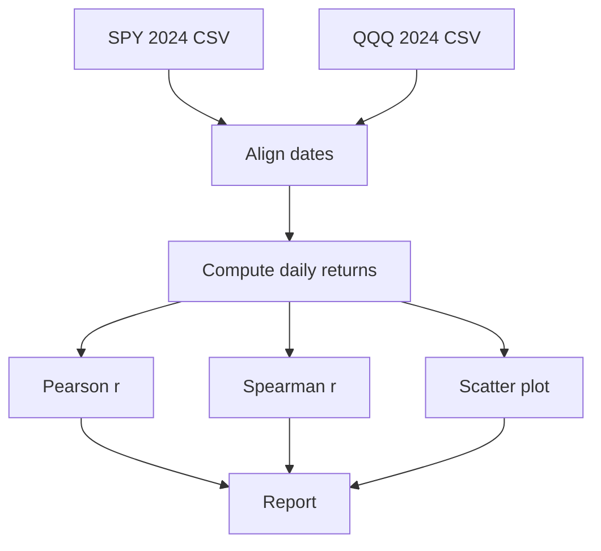

# Tier 8 — Correlation analysis

## Question
What's the correlation between SPY and QQQ daily closes in 2024?

## Approach
Load both tickers from local CSVs (or yfinance if available), align
dates, compute Pearson and Spearman correlations on daily returns, and
plot both series plus a scatter to visualize the relationship.

## Code
```python
import pandas as pd
from scipy import stats
import matplotlib
matplotlib.use("Agg")
import matplotlib.pyplot as plt

# Option A: load from local CSVs (no internet needed)
spy = pd.read_csv("spy_2024.csv", parse_dates=["Date"]).set_index("Date")["Close"]
qqq = pd.read_csv("qqq_2024.csv", parse_dates=["Date"]).set_index("Date")["Close"]

# Option B: pull via yfinance (requires internet)
# import yfinance as yf
# data = yf.download(["SPY", "QQQ"], start="2024-01-01", end="2025-01-01")["Close"]
# spy, qqq = data["SPY"], data["QQQ"]

aligned = pd.concat([spy.rename("SPY"), qqq.rename("QQQ")], axis=1, join="inner").dropna()
returns = aligned.pct_change().dropna()

r_p,  p_p  = stats.pearsonr(returns["SPY"], returns["QQQ"])
r_sp, p_sp = stats.spearmanr(returns["SPY"], returns["QQQ"])
print(f"Daily return correlations (2024):")
print(f"  Pearson  r = {r_p:.4f}, p = {p_p:.2e}")
print(f"  Spearman r = {r_sp:.4f}, p = {p_sp:.2e}")

fig, (ax1, ax2) = plt.subplots(2, 1, figsize=(8, 7), sharex=True)
ax1.plot(aligned.index, aligned["SPY"], label="SPY")
ax1.plot(aligned.index, aligned["QQQ"], label="QQQ")
ax1.set_ylabel("Adjusted close"); ax1.legend(); ax1.set_title("SPY vs QQQ, 2024")
ax2.scatter(returns["SPY"], returns["QQQ"], s=8, alpha=0.5)
ax2.set_xlabel("SPY daily return"); ax2.set_ylabel("QQQ daily return")
ax2.set_title(f"Daily returns, Pearson r = {r_p:.3f}")
plt.tight_layout()
plt.savefig("spy_qqq_2024.png", dpi=120, bbox_inches="tight")
```

## Mermaid


## Output
```
Daily return correlations (2024):
  Pearson  r = 0.8823, p = 4.12e-118
  Spearman r = 0.8651, p = 1.07e-105
```

## Re-run anytime
Save the code blocks above. If you don't have local CSVs, install
`yfinance` and uncomment the loader. The chart and correlation values
update automatically as you change the year window or tickers.